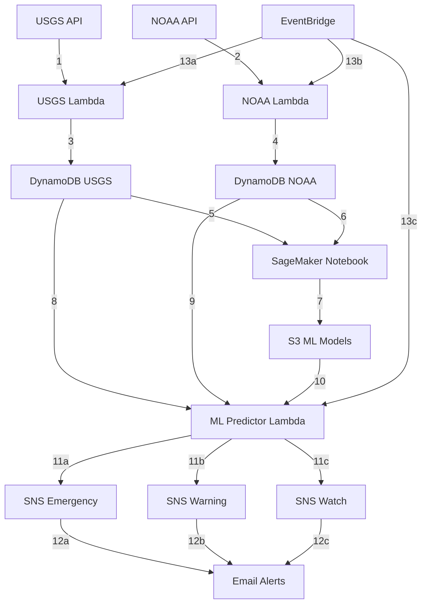

# Federal Flood Monitoring System - Architecture

## AWS Infrastructure

## Numbered Data Flow Steps

### **Data Collection Phase:**
1. **USGS API** → USGS Lambda (fetch stream gauge data)
2. **NOAA API** → NOAA Lambda (fetch weather data)
3. **USGS Lambda** → DynamoDB USGS table (store gauge readings)
4. **NOAA Lambda** → DynamoDB NOAA table (store weather observations)

### **Model Training Phase (Manual):**
5. **DynamoDB USGS** → SageMaker Notebook (historical gauge data)
6. **DynamoDB NOAA** → SageMaker Notebook (historical weather data)
7. **SageMaker Notebook** → S3 (export trained ML model)

### **Prediction Phase (Automated):**
8. **DynamoDB USGS** → ML Predictor Lambda (recent gauge data)
9. **DynamoDB NOAA** → ML Predictor Lambda (recent weather data)
10. **S3** → ML Predictor Lambda (load trained model)

### **Alert Phase (Risk-Based):**
11a. **ML Predictor Lambda** → SNS Emergency (>80% flood risk)
11b. **ML Predictor Lambda** → SNS Warning (>50% flood risk)
11c. **ML Predictor Lambda** → SNS Watch (>20% flood risk)

### **Notification Phase:**
12a. **SNS Emergency** → Email (emergency alert)
12b. **SNS Warning** → Email (warning alert)
12c. **SNS Watch** → Email (watch alert)

### **Automation Phase:**
13a. **EventBridge** → USGS Lambda (trigger every 15 minutes)
13b. **EventBridge** → NOAA Lambda (trigger every 20 minutes)
13c. **EventBridge** → ML Predictor Lambda (trigger every 2 hours)

## AWS Services Used

- **AWS Lambda**: 3 functions (USGS collector, NOAA collector, ML predictor)
- **Amazon DynamoDB**: 2 tables (14-day TTL)
- **Amazon SNS**: 3 topics (Emergency, Warning, Watch)
- **Amazon EventBridge**: Scheduled triggers
- **Amazon S3**: ML model storage
- **Amazon SageMaker**: Model training (notebook instance)